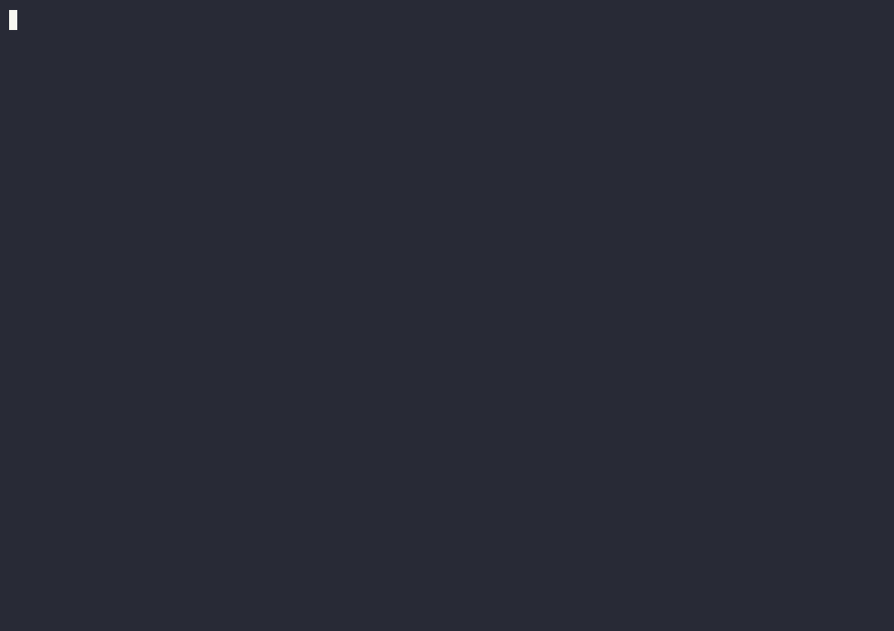

# Human generated content

**Currently linux only**

 The idea here is that the questionaire tools type things are too limited and rail roading. I've found myself copy and pasting content into my answer, and that's too much work. I'm extremely lazy.
 Why can't the LLM make that a bit easier by suggesting snippets that might be good replies? This is very much inspired by *Human Compatible* by Stuart Russell. 

So that's what this attempts to do.

An earlier version also had a web UI, but the best interface is the TUI for me at the moment. Mostly since it doesn't change my workflow now.

Below is what the machine created. Fable 5 did the initial design costing about 93 $ in credits, refinement with opus 5 and sonnet 5, and now glm 5.3-flash.

## Design history
Originally I tried having the TUI extension do mouse reporting, but that sacrificed scrollback and other terminal TUI functionality. Landing on markdown hyperlink rendering made me realize I could instead register an `xdg-open` handler, since my instinct already wanted to Ctrl+click links.

## TODOs
- [ ] Merge the examples for the infference (2nd model ) and the system propmt variety.
# pi-snippet
**Below is 99% clanker generated.**

Inline suggestion snippets for [pi](https://github.com/earendil-works/pi-mono). The model marks spans of its own prose as *suggested user replies* by wrapping them in `<snippet>…</snippet>`; the extension renders those spans in pi's terminal UI as clickable chips you can insert into the composer. Inserting never sends — you can edit the text, add to it, or ignore it.

What the model writes:

```
Want me to <snippet>rebuild the solution</snippet> or <snippet>run the tests</snippet>?
```

renders as

> Want me to [¹rebuild the solution](pisnip://…) or [²run the tests](pisnip://…)?

— link-styled text led by a small superscript number. The superscript is all a chip needs: `Alt+N` addresses it, and the URL behind it stays hidden whenever the terminal supports hyperlinks. On terminals that cannot paint a hyperlink the chip paints as a bare label — inert rather than falling back to some other input mode.

## What it looks like



Real pi, the real extension, and the repo's own `snippet-demo` skill
(`.pi/skills/snippet-demo`) for the scenario. The model is
`test/fixtures/mock-llm.js` playing both parts, so the recording costs nothing
and comes out the same every time — everything the reply is *rendered into* is
the extension's own output.

What is happening in it:

- **¹–⁵ are the primary model's own tags**, and each goes live the moment its
  closing tag arrives — the first three are already clickable in the frame
  where the message is still being written.
- **⁶ ⁷ ⁸ are the second model's.** It read the finished message and tagged the
  three names the primary left bare; they take the next free numbers instead of
  renumbering chips already on screen. The footer tracks that pass: `not sent`
  while the message streams, `sent (waiting)` while the second model writes,
  then `3 new chips`. On the next message it has nothing to add and says so —
  `0 new chips`.
- **`Alt+7` puts *Kevin* in the composer**, where it gets `, obviously` typed
  onto the end before it is sent. Inserting never sends.

Ctrl+click does the same thing with the mouse, and is the one part a terminal
recording cannot show — the click is resolved by the desktop, not by anything
in the frame.

Re-record it with `python3 scripts/readme-demo.py` (needs `asciinema`; render
the GIF with [`agg`](https://github.com/asciinema/agg)). The cast itself is
`docs/demo/pi-snippet.cast`.

## Install

```bash
pi install /path/to/pi-snippet/src/extension/pi-snippet-tui.ts
```

or keep loading it per run with `pi -e /path/to/pi-snippet/src/extension/pi-snippet-tui.ts`.

## Using it

- **Ctrl+click a chip** to insert it. The click is resolved by the terminal itself — the chip's href is a real `pisnip://` URL, and the desktop dispatches it back to the pi session that painted it. No terminal-wide mouse mode is ever engaged: the scroll wheel and text selection are never taken away. One-time setup: the first chip of a session offers to register the handler, and `/snippets` → *Register click handler* does the same thing whenever you want it (Linux; needs a terminal that paints OSC 8 hyperlinks — Ghostty, kitty, WezTerm, …).
- **`Alt+N`** inserts the Nth suggestion of the most recent message. Beyond ten, hold Alt and type two digits; `Alt+0` means the tenth. A chip goes live the moment its closing tag arrives, so you can answer while the model is still writing, and numbering never shifts as more suggestions stream in.
- **`/snippets`** chooses where chips come from — `off`, `tags only`, `tags + second model`, or `second model only` — and registers or removes the click handler. The choices are remembered in `~/.pi/agent/pi-snippet.json`. `--no-suggestions` disables everything for one session.

## Over SSH: built, and never once used by a human

Over SSH the click resolves on the machine in front of you, whose desktop has
no socket for the session — that lives on the server. So the chip's URL names
the server: `pisnip://<host>/<token>/<msg>/cN`. The handler on your machine
finds no local socket, reads the host out of the URL, and tunnels the click
back through a fresh `ssh` running a fixed python one-liner. Nothing is
installed on the server, nothing is configured on the client, and there is no
toggle, no flag and nothing per session — a remote session paints exactly the
chips a local one does.

What replaced the config file that used to list the hosts a click could go to
is ssh's own list: the relay runs `BatchMode=yes`, so a host that is not
already in your `known_hosts` is refused at the host-key check, before
authentication. See `docs/adr/0001-the-chip-url-names-its-server.md` for why
that trade was made and what ships alongside it.

**Nobody has actually done this.** It is asserted end to end by an automated
harness — two containers, real sshd, real pi on the server, real handler
dispatch on the client, 22 checks including the click landing in the remote
composer, a restarted session, a URL naming a host the client has never
connected to (which must deliver nothing), and hosts `ssh` would read as an
option (which must be refused before anything is spawned) — and by the unit
tests. That is not the same as a person connecting from their laptop to their
own box and clicking a chip. Until someone does, treat all of the above as
unproven: the failure modes are quiet by design, so the way it breaks for you
will probably be a chip that does nothing.

Two things it needs, both easy to miss: the click handler registered on the
*client* (a local pi session there will offer it at its first chip, or
`/snippets` → *Register click handler*; Linux only — a remote session only
tells you that is where it belongs, since it cannot register anything on your
desktop), and an ssh
back to the server that works without typing anything — the relay runs
`BatchMode=yes` so a click can never hang on a password prompt. One thing it
assumes: that the server's own `hostname` is a name your machine can dial. Where
it is not — a cloud instance called `ip-10-0-3-14`, say — set `PI_SNIPPET_HOST`
on the server to the name you actually use. The `ssh -L` socket forward that
used to be the other way in has been removed, as have the client host list and
the one-time bootstrap line that preceded the URL naming its own server.

## Inferred chips: not Fully baked yet

Besides the tags the model writes itself, a second small model can read each finished message and add more tags. The mode exists and might work if you hold it right.

## How it works

The model wraps reply-shaped spans of its prose in `<snippet>` tags. The extension renders each tag as a hyperlink whose URL names a per-session unix socket; a registered desktop handler receives the terminal-resolved click and forwards it to that socket, which inserts the chip's text into the composer. Stored messages keep their raw tags — the rendering is display-only, so any other transcript consumer reads them unharmed.

## Roadmap

- **Someone using the SSH path for real.** It is written, documented
  (`docs/ssh-back-handler.md`) and covered by a two-container harness, and no
  human has been through it once. That is the next thing it needs, ahead of any
  more code.
- **macOS and Windows clients.** The handler is Linux-only — `xdg-open` and
  `mimeapps.list` — so a Mac or Windows client cannot receive the click at all,
  over SSH or otherwise. `docs/cross-platform.md` has what each would take.

## Tests

```bash
npm test          # unit and integration tests
npm run check     # tsc --noEmit
npm run test:e2e  # live, against a real model through pi RPC
```

No test makes a live model call except the e2e, which spawns pi in RPC mode and asserts the model emits well-formed tags (configure with `PI_SNIPPET_TEST_PROVIDER` and `PI_SNIPPET_TEST_MODEL`).
